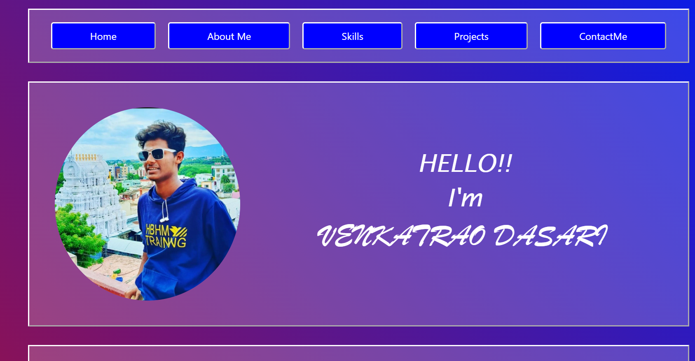
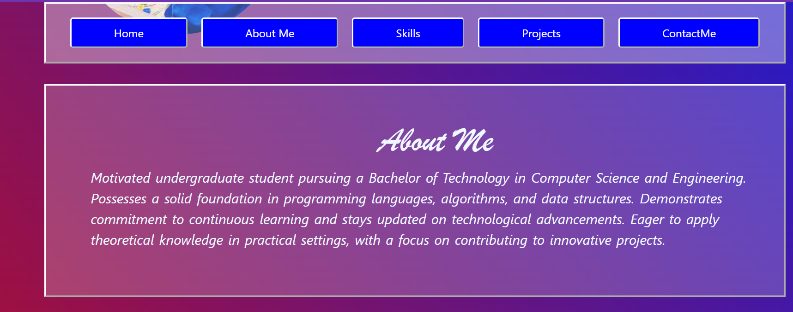
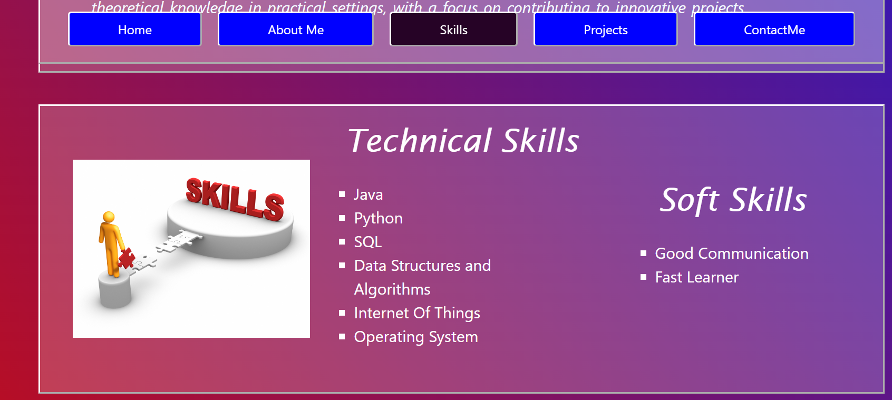
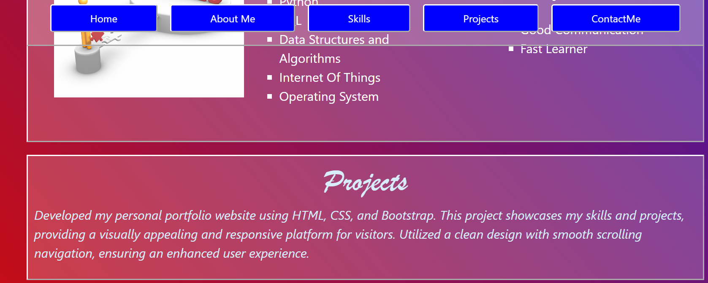
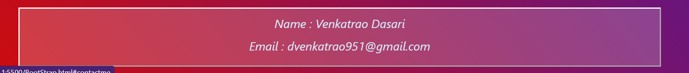

# PersonalPortfolio

Welcome to my personal portfolio repository! This project represents my online portfolio, showcasing my skills, projects, and experiences.

## Table of Contents
- [Introduction](#introduction)
- [Features](#features)
- [Technologies Used](#technologies-used)
- [Project Structure](#project-structure)
- [Screenshots](#screenshots)
- [How to Use](#how-to-use)
- [Contact](#contact)

## Introduction
This repository contains the code for my personal portfolio website. It is designed to provide visitors with an overview of my background, skills, and projects in a visually appealing and responsive manner.

## Features
- **Navigation:** Smooth scrolling navigation with a sticky navigation bar for easy access to different sections.
- **Sections:** Organized into sections like Home, About Me, Skills, Projects, and Contact Me.
- **Responsive Design:** Utilizes Bootstrap for a responsive and mobile-friendly layout.

## Technologies Used
- HTML
- CSS
- Bootstrap 4.3.1

## Project Structure
- **`index.html`:** Main HTML file containing the structure of the portfolio.
- **`styles.css`:** External stylesheet for styling the portfolio.
- **`MyPic.jpg`:** Image file for the profile picture.
- **`skills.jpg`:** Image file for the skills section.

## Screenshots

## How to Use
1. Clone the repository: `git clone https://github.com/venkatarao2255/PersonalPortfolio.git`
2. Open `index.html` in a web browser.

Feel free to explore the different sections and learn more about me and my work!

## Contact
- **Name:** Venkatrao Dasari
- **Email:** dvenkatrao951@gmail.com
